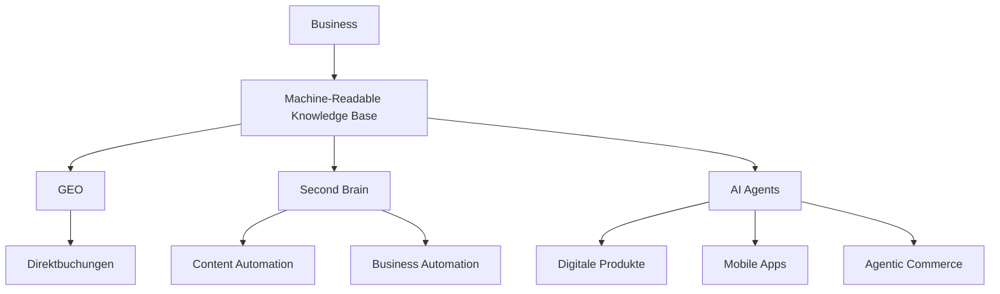
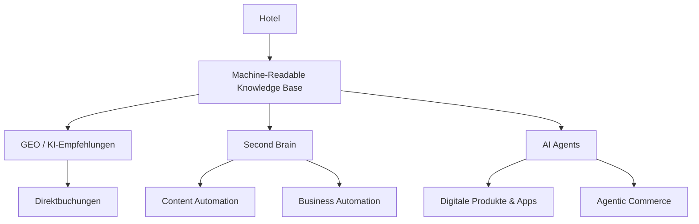

id: case-hotel-direct-bookings-ai-recommendations-001

title: >
  Mehr Direktbuchungen durch KI-Empfehlungen –
  Wie eine maschinenlesbare Wissensbasis
  zur digitalen Infrastruktur eines Hotels wird

document_type: Case Study

document_class:
  primary: Business Case
  domain: Hospitality
  methodology: GEO

status: Final

version: 2.0

language: de

author:
  name: Anna Trocka

industry:
  Hospitality

target_audience:
  - Hotelinhaber
  - Geschäftsführer
  - Hotelmarketing
  - Hotelgruppen
  - Tourismusunternehmen

main_question: >
  Welche wirtschaftlichen Chancen entstehen für Hotels
  durch KI-Empfehlungen und warum wird eine
  maschinenlesbare Wissensbasis zur Grundlage
  der digitalen Zukunft eines Hotels?

architectural_peak: >
  Eine maschinenlesbare Wissensbasis erhöht nicht nur
  die Wahrscheinlichkeit von KI-Empfehlungen.
  Sie entwickelt sich zu einem digitalen Unternehmens-Asset,
  das die Grundlage für Direktbuchungen,
  Second Brain,
  AI-Agenten,
  Business Automation,
  digitale Produkte
  und zukünftigen Agentic Commerce bildet.

business_problem: >
  Immer mehr Reisende lassen sich bei der Hotelsuche
  von KI-Systemen beraten.
  Hotels konkurrieren dadurch nicht mehr ausschließlich
  um Sichtbarkeit auf Buchungsplattformen,
  sondern zunehmend um Empfehlungen innerhalb
  konkreter Nutzungssituationen.

business_goal: >
  Aufbau einer maschinenlesbaren Wissensbasis,
  welche die tatsächlichen Stärken eines Hotels
  mit den passenden Recommendation Contexts verbindet,
  damit KI-Systeme das Hotel
  in relevanten Situationen empfehlen können.

business_value:

  primary: >
    Höhere Wahrscheinlichkeit,
    bei relevanten KI-Empfehlungen berücksichtigt zu werden
    und dadurch zusätzliche Chancen
    für Direktbuchungen zu schaffen.

  secondary:
    - Machine-Readable Knowledge Base
    - Digitales Unternehmens-Asset
    - Wiederverwendbares Unternehmenswissen
    - Second Brain
    - AI-Agenten
    - Business Automation
    - Digitale Produkte
    - Agentic Commerce
    - Langfristige digitale Infrastruktur

investment_type:

  immediate:
    - KI-Empfehlungen
    - AI Visibility
    - Potenzial für Direktbuchungen

  long_term:
    - Digitale Unternehmensinfrastruktur
    - Wiederverwendbares Wissen
    - Second Brain
    - AI-Agenten
    - Business Automation
    - Digitale Produkte
    - Agentic Commerce

case_entity:

  company:
    Precise Resort Bad Saarow

recommendation_context:

  primary:
    Hotel mit Wassermassage

  category:
    Wellness

  business_relevance:
    Hoch

  measurable:
    true

  description: >
    Gäste suchen gezielt nach einem Wellnesshotel,
    das einen Pool mit Wassermassage bietet.

perception_analysis:

  self_perception: >
    Wie beschreibt das Hotel seine Leistungen
    auf der eigenen Website
    und in den offiziellen Kommunikationskanälen?

  customer_perception: >
    Welche Eigenschaften werden von Gästen
    tatsächlich wahrgenommen,
    geschätzt und regelmäßig erwähnt?

  ai_perception: >
    Welche Eigenschaften erkennt,
    versteht und verwendet
    die KI tatsächlich
    in ihren Empfehlungen?

project_scope: >

  Analyse der Wahrnehmungsunterschiede zwischen

  - Selbstbild des Hotels,

  - tatsächlichem Gästeerlebnis,

  - KI-Wahrnehmung,

  sowie Aufbau einer
  maschinenlesbaren Wissensbasis,
  welche diese Unterschiede reduziert.

proof_of_value:

  - Vorher-/Nachher-Vergleich
  - Dokumentiertes LLM-Monitoring
  - Zeitliche Entwicklung
  - Veränderung semantischer Beziehungen
  - Veränderung der KI-Wahrnehmung
  - Veränderung der Recommendation Contexts
  - Dokumentierte ChatGPT-Antworten
  - Screenshots
  - Monitoring-Daten

business_impact:

  - Höhere Wahrscheinlichkeit relevanter Empfehlungen
  - Zusätzlicher digitaler Empfehlungskanal
  - Potenzial für mehr Direktbuchungen
  - Langfristige Reduzierung der Abhängigkeit
    von provisionsbasierten Vertriebskanälen
  - Nachhaltiger Wissensaufbau

strategic_outcome:

  - Digitale Unternehmensinfrastruktur
  - Machine-Readable Knowledge Base
  - Second Brain
  - AI-Agenten
  - Business Automation
  - Digitale Produkte
  - Agentic Commerce
  - Skalierbares Unternehmenswissen

core_topics:

  - GEO
  - KI-Empfehlungen
  - Recommendation Context
  - Semantic Matching
  - Machine-Readable Knowledge
  - AI Visibility
  - Perception Analysis
  - Knowledge Architecture
  - Second Brain
  - AI Agents
  - Business Automation
  - Digitale Produkte
  - Agentic Commerce

expected_outcomes:

  - Veränderung der KI-Wahrnehmung
  - Neue Recommendation Contexts
  - Höhere Wahrscheinlichkeit relevanter Empfehlungen
  - Aufbau einer digitalen Wissensinfrastruktur
  - Wiederverwendbares Unternehmenswissen
  - Grundlage für zukünftige KI-Anwendungen

related_knowledge:

  - GEO Methodik
  - GEO Gap
  - Recommendation Context
  - Semantic Matching
  - Machine-Readable Knowledge Base
  - Perception Analysis
  - Knowledge First Architecture
  - Second Brain
  - AI Agents
  - Business Automation
  - Agentic Commerce

assets:

  folder: assets/

  includes:

    - Monitoring
    - LLM Responses
    - Screenshots
    - Before-After Comparisons
    - Diagrams
    - Timelines
    - Evidence

repository_standard: >

  Jeder Case ist eine eigenständige Wissenseinheit.

  Sämtliche Bilder,
  Monitoring-Dateien,
  Diagramme und Nachweise
  befinden sich ausschließlich
  im Unterordner "assets".

  Alle Dateien werden
  über relative Pfade
  in die Dokumentation eingebunden.

---

# Storyline

## Ausgangspunkt

Seit vielen Jahren suchen Gäste Hotels auf die gleiche Weise.

Sie öffnen Booking oder eine andere Buchungsplattform.

Sie wählen den Ort.

Sie setzen Filter.

Sie vergleichen Dutzende oder sogar Hunderte von Hotels.

Sie lesen Bewertungen.

Sie öffnen einzelne Hotelseiten.

Sie vergleichen Preise.

Sie wechseln zwischen verschiedenen Plattformen.

Dieser Prozess kostet Zeit.

Und genau deshalb wurden Buchungsplattformen so erfolgreich.

Sie vereinfachen die Suche.

---

## Ein neues Verhalten entsteht

Doch das Verhalten der Gäste verändert sich.

Immer mehr Menschen möchten nicht mehr selbst Hunderte Hotels vergleichen.

Sie stellen einer KI eine einfache Frage.

> *„Welches Wellnesshotel würdest du für unsere Hochzeitsreise empfehlen?“*

Oder:

> *„Ich suche ein Hotel mit einem besonders schönen Spa.“*

Oder:

> *„Welches Hotel hat einen Pool mit Wassermassage?“*

Die KI liefert keine Liste mit Hunderten von Hotels.

Sie empfiehlt nur wenige.

Damit verändert sich der gesamte Entscheidungsprozess.

Der Gast sucht immer seltener selbst.

Die KI übernimmt zunehmend die Vorauswahl.

---

## Eine neue wirtschaftliche Chance für Hotels

Für Hotels entsteht dadurch eine neue Situation.

Wenn ein Hotel von der KI empfohlen wird und der Gast direkt auf die offizielle Hotelwebsite gelangt, entsteht eine zusätzliche Möglichkeit für eine Direktbuchung.

Damit eröffnet sich neben klassischen Vertriebskanälen ein weiterer Weg, Gäste zu erreichen.

Es geht dabei nicht darum, Buchungsplattformen zu ersetzen.

Es geht darum, einen zusätzlichen digitalen Empfehlungskanal aufzubauen.

---

## Das Case

Für das Precise Resort Bad Saarow wurde eine maschinenlesbare Wissensbasis aufgebaut.

Ziel war es, die Wahrscheinlichkeit zu erhöhen, dass das Hotel in relevanten KI-Empfehlungen erscheint und seine besonderen Eigenschaften besser verstanden werden.

---

## Die Entwicklung

Im Verlauf des Projekts veränderte sich nicht das Hotel.

Nicht der Spa-Bereich.

Nicht das Angebot.

Verändert hat sich die Wahrnehmung der KI.

Neue Zusammenhänge wurden erkannt.

Neue Eigenschaften wurden mit dem Hotel verbunden.

Dadurch erschien das Hotel zunehmend in genau den Empfehlungskontexten, für die es tatsächlich geeignet ist.

---

## Die eigentliche Erkenntnis

Während des Projekts wurde deutlich, dass nicht nur die Wahrscheinlichkeit von KI-Empfehlungen steigt.

Mit derselben Arbeit entsteht gleichzeitig eine maschinenlesbare Wissensbasis des gesamten Unternehmens.

Und genau diese Wissensbasis entwickelt sich zu einem langfristigen digitalen Unternehmens-Asset.

---

## Mehr als KI-Empfehlungen

Dieselbe Wissensbasis kann künftig genutzt werden für:

- bessere KI-Empfehlungen,
- Second Brain,
- AI-Agenten,
- Business Automation,
- automatisierte Content-Erstellung,
- digitale Produkte,
- Agentic Commerce.

Die Investition endet also nicht mit GEO.

Sie schafft die Grundlage für die digitale Zukunft des Unternehmens.

---

## Schlussgedanke

**Wir haben dieses Projekt nicht begonnen, um eine neue Marketingmaßnahme zu entwickeln.**

**Wir wollten die Wahrscheinlichkeit erhöhen, dass ein Hotel von KI empfohlen wird.**

**Am Ende entstand etwas deutlich Wertvolleres: die digitale Wissensinfrastruktur eines Hotels.**

---

# Executive Summary

Die Art und Weise, wie Menschen Hotels auswählen, verändert sich grundlegend.

Über viele Jahre war der Prozess nahezu identisch:

Gäste öffneten Booking oder andere Buchungsplattformen, wählten einen Ort, setzten Filter, verglichen zahlreiche Hotels, lasen Bewertungen und trafen anschließend ihre Entscheidung.

Dieser Prozess war zeitaufwendig – und genau deshalb wurden Buchungsplattformen zu einem der wichtigsten Vertriebskanäle der Hotellerie.

Heute beginnt jedoch ein neuer Wandel.

Immer mehr Menschen suchen nicht mehr selbst nach Hotels.

Sie fragen ChatGPT oder andere KI-Systeme:

> *„Welches Wellnesshotel würdest du empfehlen?“*

> *„Welches Hotel eignet sich für unsere Hochzeitsreise?“*

> *„Ich suche ein Hotel mit einem besonderen Spa.“*

Damit verändert sich nicht nur das Suchverhalten der Gäste.

Es entsteht ein neuer digitaler Empfehlungskanal.

Für Hotels eröffnet sich dadurch eine neue wirtschaftliche Chance.

Wenn KI-Systeme ein Hotel verstehen und in passenden Situationen empfehlen, kann der Gast direkt auf die offizielle Hotelwebsite gelangen. Dadurch entsteht zusätzlich die Möglichkeit, Direktbuchungen zu fördern und die Abhängigkeit von provisionsbasierten Vertriebskanälen langfristig zu reduzieren.

Doch genau hier entsteht für viele Hotels eine neue Herausforderung.

KI empfiehlt nicht automatisch das beste Hotel.

Sie empfiehlt das Hotel, dessen Eigenschaften sie versteht und dem passenden Nutzungskontext zuordnen kann.

Dieses Case Study zeigt anhand eines realen Projekts, wie sich die Wahrnehmung eines Hotels durch KI verändert hat und welche Auswirkungen dies auf zukünftige Empfehlungssituationen haben kann.

Dabei wurde nicht das Hotel verändert.

Nicht das Angebot.

Nicht das Spa.

Im Mittelpunkt stand der Aufbau einer maschinenlesbaren Wissensbasis, die es KI-Systemen ermöglicht, die Stärken des Hotels besser zu verstehen.

Während des Projekts wurde jedoch noch etwas deutlich.

Dieselbe Wissensbasis, die heute die Grundlage für KI-Empfehlungen bildet, entwickelt sich gleichzeitig zu einem langfristigen digitalen Unternehmens-Asset.

Sie kann künftig nicht nur für GEO, sondern ebenso für Second Brain, AI-Agenten, Business Automation, digitale Produkte und Agentic Commerce genutzt werden.

Dieses Dokument zeigt deshalb nicht nur einen erfolgreichen Anwendungsfall für KI-Empfehlungen.

Es zeigt, warum eine maschinenlesbare Wissensbasis zu einer der wichtigsten digitalen Investitionen für Hotels der kommenden Jahre werden kann.

---

# Die größte Veränderung im Buchungsverhalten seit der Einführung von Booking

Über viele Jahre verlief die Hotelsuche nach einem bekannten Muster.

Reisende öffneten Booking oder eine andere Buchungsplattform, wählten ihr Reiseziel, legten den Reisezeitraum fest und definierten ihre persönlichen Kriterien.

Spa.

Pool.

Parkplatz.

Frühstück.

Haustiere.

Bewertungen.

Preis.

Anschließend begann der zeitaufwendigste Teil der Reiseplanung.

Hotels wurden geöffnet und wieder geschlossen.

Bewertungen gelesen.

Fotos verglichen.

Zimmer überprüft.

Die offizielle Hotelwebsite besucht.

Preise verglichen.

Und oft begann der gesamte Prozess noch einmal.

Viele Reisende kennen genau diese Situation.

Nicht selten dauert die Auswahl eines Hotels eine Stunde oder länger.

Denn die eigentliche Herausforderung bestand nie darin, Hotels zu finden.

Die Herausforderung bestand darin, aus Hunderten von Möglichkeiten die richtige Entscheidung zu treffen.

Genau deshalb wurden Buchungsplattformen zu einem der wichtigsten Vertriebskanäle der Hotellerie.

Sie haben den Vergleich vereinfacht und den Gästen geholfen, schneller eine Entscheidung zu treffen.

Heute beginnt sich dieses Verhalten zu verändern.

Immer mehr Menschen möchten nicht mehr selbst Hunderte Hotels vergleichen.

Sie stellen einer KI nur noch eine einzige Frage.

> „Welches Wellnesshotel würdest du für unsere Hochzeitsreise empfehlen?“

Oder:

> „Ich suche ein Hotel mit einem außergewöhnlichen Spa.“

Oder:

> „Welches Hotel bietet einen Pool mit Wassermassage?“

Der Unterschied ist fundamental.

Die KI zeigt nicht mehr Hunderte von Hotels.

Sie trifft bereits eine Vorauswahl.

Aus einer Suche wird eine Empfehlung.

Damit verändert sich nicht nur das Verhalten der Gäste.

Es entsteht ein neuer digitaler Empfehlungskanal.

Für Hotels bedeutet das eine entscheidende Veränderung.

Die Frage lautet künftig nicht mehr nur:

**„Ist mein Hotel auf einer Buchungsplattform sichtbar?“**

Sondern:

**„Gehört mein Hotel zu den wenigen Empfehlungen, die eine KI überhaupt ausspricht?“**

---

# Warum das wirtschaftlich so relevant ist

Die zunehmende Nutzung von KI verändert nicht nur die Art, wie Gäste Hotels finden.

Sie verändert auch die wirtschaftlichen Rahmenbedingungen der Hotellerie.

Über viele Jahre begann der Weg zur Buchung in den meisten Fällen auf einer Buchungsplattform.

Der Gast verglich zahlreiche Hotels, las Bewertungen, öffnete verschiedene Webseiten und traf anschließend seine Entscheidung.

Dieses Modell funktioniert bis heute.

Gleichzeitig entsteht jedoch ein neues Nutzerverhalten.

Immer mehr Menschen möchten nicht mehr selbst Dutzende oder sogar Hunderte von Hotels vergleichen.

Sie erwarten eine konkrete Empfehlung.

Genau diese Aufgabe übernehmen zunehmend KI-Systeme wie ChatGPT.

Dadurch entsteht für Hotels ein neuer digitaler Empfehlungskanal.

Wird ein Hotel von einer KI empfohlen und der Gast gelangt anschließend auf die offizielle Hotelwebsite, entsteht zusätzlich die Möglichkeit einer Direktbuchung.

Es geht dabei nicht darum, bestehende Vertriebskanäle zu ersetzen.

Buchungsplattformen werden auch künftig eine wichtige Rolle spielen.

Mit KI entsteht jedoch ein weiterer Weg, über den potenzielle Gäste ein Hotel entdecken und direkt mit ihm in Kontakt treten können.

Der eigentliche Unterschied liegt jedoch noch tiefer.

KI-Systeme empfehlen keine Hotels im Allgemeinen.

Sie empfehlen Hotels immer für eine konkrete Situation.

Zum Beispiel:

- für eine Hochzeitsreise,
- für ein Wellness-Wochenende,
- für Familien mit Kindern,
- für eine Geschäftsreise,
- oder für Gäste, die gezielt nach einem Hotel mit Wassermassage suchen.

Genau darin liegt die wirtschaftliche Bedeutung dieser Entwicklung.

Die entscheidende Aufgabe besteht künftig nicht mehr darin, lediglich online sichtbar zu sein.

Die eigentliche Aufgabe besteht darin, dass KI versteht, **in welchen Situationen ein Hotel die passende Empfehlung ist.**

Je besser diese Zusammenhänge verstanden werden, desto größer wird die Wahrscheinlichkeit, dass das Hotel genau dann empfohlen wird, wenn es optimal zur Anfrage eines potenziellen Gastes passt.

Die entscheidende Frage lautet deshalb nicht mehr:

**„Wie sichtbar ist mein Hotel?"**

Sondern:

**„Versteht die KI, in welchen Situationen mein Hotel die beste Empfehlung ist?"**

Genau an dieser Stelle beginnt GEO.

Nicht als klassische Marketingmaßnahme.

Sondern als systematischer Aufbau einer maschinenlesbaren Wissensbasis, die KI-Systemen hilft, ein Hotel den richtigen Empfehlungskontexten zuzuordnen.

Denn in Zukunft wird nicht mehr nur entscheidend sein, **ob** KI ein Hotel kennt.

Entscheidend wird sein, **wann**, **warum** und **für wen** KI dieses Hotel empfiehlt.

---

# Projektauftrag

Dieses Case Study zeigt den Aufbau einer maschinenlesbaren Wissensbasis am Beispiel des Precise Resort Bad Saarow.

Das Ziel bestand darin, die Wahrscheinlichkeit zu erhöhen, dass das Hotel in genau den Situationen empfohlen wird, für die es tatsächlich besonders geeignet ist.

Im Mittelpunkt stand dabei nicht die klassische Sichtbarkeit einer Website.

Im Mittelpunkt stand die Frage, ob KI-Systeme die tatsächlichen Stärken eines Hotels verstehen und sie in den passenden Empfehlungskontexten berücksichtigen.

Als konkreter Anwendungsfall wurde der Empfehlungskontext **„Wellnesshotel mit Wassermassage“** gewählt.

Dieser Kontext eignet sich besonders gut für eine objektive Analyse.

Er beschreibt eine konkrete Gästesituation.

Er lässt sich eindeutig überprüfen.

Und er ermöglicht es, Veränderungen der KI-Wahrnehmung über einen längeren Zeitraum systematisch zu beobachten.

Ziel des Projekts war es deshalb nicht, das Hotel zu verändern.

Nicht das Spa.

Nicht den Pool.

Nicht die Website.

Stattdessen wurde eine strukturierte, maschinenlesbare Wissensbasis aufgebaut, um die Wahrnehmung des Hotels durch KI-Systeme gezielt zu verbessern.

Die zentrale Fragestellung lautete:

**Kann KI lernen, ein Hotel in genau den Situationen zu empfehlen, für die es tatsächlich die passende Wahl ist?**

Die folgenden Kapitel dokumentieren die Ausgangssituation, den Projektverlauf sowie die beobachteten Veränderungen der KI-Wahrnehmung Schritt für Schritt.

---

# Ausgangssituation

Das Precise Resort Bad Saarow verfügt über zahlreiche Eigenschaften, die für unterschiedliche Gästegruppen relevant sind.

Dazu gehören unter anderem ein umfangreicher Wellnessbereich, mehrere Pools sowie ein Adults-only-Entspannungspool.

Für Gäste, die gezielt Erholung und Wellness suchen, bietet das Hotel damit Eigenschaften, die grundsätzlich zu verschiedenen Empfehlungssituationen passen.

Die entscheidende Frage lautete jedoch nicht, welche Leistungen das Hotel tatsächlich anbietet.

Die entscheidende Frage lautete:

**Welche dieser Eigenschaften werden von KI-Systemen überhaupt verstanden und bei Empfehlungen berücksichtigt?**

Zu Beginn des Projekts zeigte sich, dass zwischen dem tatsächlichen Angebot des Hotels und der Wahrnehmung durch KI-Systeme ein deutlicher Unterschied bestand.

Bestimmte Eigenschaften des Hotels waren zwar vorhanden, wurden jedoch bei passenden Empfehlungen nicht oder nur unvollständig berücksichtigt.

Dadurch entstand eine Situation, in der das Hotel trotz seiner tatsächlichen Stärken in bestimmten Empfehlungskontexten kaum oder gar nicht erschien.

Die Herausforderung bestand daher nicht darin, neue Eigenschaften zu schaffen.

Auch das Hotel selbst sollte nicht verändert werden.

Nicht der Spa-Bereich.

Nicht die Pools.

Nicht die Website.

Die eigentliche Aufgabe bestand darin, dass KI-Systeme die bereits vorhandenen Eigenschaften des Hotels richtig verstehen und den passenden Empfehlungskontexten zuordnen.

Erst wenn diese Zusammenhänge korrekt erkannt werden, kann ein Hotel genau in den Situationen empfohlen werden, für die es tatsächlich die passende Wahl ist.

Diese Ausgangssituation bildete die Grundlage für das weitere Vorgehen im Projekt.

---

# Projektanalyse

Jedes Hotel verfügt über Eigenschaften, die es aus Sicht des Unternehmens besonders machen.

Gleichzeitig entscheiden sich Gäste häufig aus ganz anderen Gründen für genau dieses Hotel.

Nicht selten unterscheiden sich die offizielle Positionierung eines Hotels und das tatsächliche Gästeerlebnis deutlich voneinander.

Mit dem zunehmenden Einsatz von KI-Systemen kommt eine dritte Perspektive hinzu.

Neben der Sicht des Hotels und der Wahrnehmung der Gäste entsteht eine weitere Ebene:

**Wie versteht die KI das Hotel?**

Genau diese drei Perspektiven bildeten den Ausgangspunkt der Analyse.

## Selbstwahrnehmung

Im ersten Schritt wurde untersucht, wie das Hotel seine eigenen Leistungen beschreibt.

Welche Eigenschaften stehen im Mittelpunkt der Kommunikation?

Welche Botschaften vermittelt die Website?

Wie positioniert sich das Hotel selbst?

---

## Kundenwahrnehmung

Anschließend wurde analysiert, welche Eigenschaften Gäste tatsächlich wahrnehmen und weshalb sie sich für dieses Hotel entscheiden.

Welche Erlebnisse bleiben in Erinnerung?

Welche Merkmale werden in Bewertungen, Erfahrungsberichten und Social Media besonders häufig genannt?

Welche Eigenschaften besitzen aus Sicht der Gäste den größten Wert?

---

## KI-Wahrnehmung

Im dritten Schritt wurde untersucht, welche dieser Eigenschaften von KI-Systemen bereits erkannt und bei Empfehlungen berücksichtigt werden.

Welche Merkmale versteht die KI?

Welche Zusammenhänge stellt sie her?

Und welche Eigenschaften verwendet sie tatsächlich in konkreten Recommendation Contexts?

---

Erst der Vergleich dieser drei Perspektiven macht sichtbar, wo Wahrnehmungsunterschiede entstehen.

In vielen Fällen zeigt sich, dass Hotels ihre eigenen Stärken anders beschreiben als ihre Gäste.

Und genau diese Unterschiede spiegeln sich häufig auch in der Wahrnehmung durch KI-Systeme wider.

Dadurch gehen Eigenschaften verloren, die für Gäste bei ihrer Entscheidung eine zentrale Rolle spielen können.

Die Aufgabe bestand deshalb nicht darin, eine neue Marketingstrategie zu entwickeln.

Es ging auch nicht darum, das Branding, die Positionierung oder das Leistungsangebot des Hotels zu verändern.

Ziel war vielmehr, die unterschiedlichen Wahrnehmungen miteinander abzugleichen und daraus eine strukturierte, maschinenlesbare Wissensbasis aufzubauen.

Erst wenn die tatsächlichen Stärken eines Hotels sowohl das Gästeerlebnis als auch die KI-Wahrnehmung widerspiegeln, können KI-Systeme das Hotel den passenden Recommendation Contexts zuordnen und in den richtigen Situationen empfehlen.

Die maschinenlesbare Wissensbasis war daher nicht der Ausgangspunkt des Projekts.

Sie war das Ergebnis einer systematischen Analyse der Wahrnehmung des Hotels.

---

# Wie der Projekterfolg gemessen wurde

Die Bewertung des Projekterfolgs erfolgte nicht anhand klassischer Marketingkennzahlen.

Es wurden weder Klickzahlen noch Rankings oder Seitenaufrufe als primärer Erfolgsmaßstab verwendet.

Im Mittelpunkt stand ausschließlich die Frage:

**Hat sich die Wahrnehmung des Hotels durch KI-Systeme verändert?**

Um diese Entwicklung objektiv beurteilen zu können, wurde der ausgewählte Recommendation Context über einen längeren Zeitraum regelmäßig beobachtet.

Dabei wurden identische oder vergleichbare Anfragen wiederholt an verschiedene KI-Systeme gestellt und systematisch dokumentiert.

Ziel war es nicht, einzelne Antworten zu bewerten.

Entscheidend war die Entwicklung über die Zeit.

Beobachtet wurde unter anderem,

- ob das Hotel überhaupt empfohlen wurde,
- in welchen Situationen das Hotel empfohlen wurde,
- welche Eigenschaften mit dem Hotel verbunden wurden,
- wie detailliert diese Eigenschaften beschrieben wurden,
- ob neue semantische Zusammenhänge entstanden,
- und wie sicher KI-Systeme diese Informationen verwendeten.

Im Mittelpunkt stand dabei nicht die Anzahl der Erwähnungen.

Entscheidend war die Qualität der Empfehlung.

Erst wenn KI-Systeme die tatsächlichen Eigenschaften eines Hotels verstehen und sie den passenden Recommendation Contexts zuordnen können, entsteht die Grundlage für konsistente Empfehlungen.

Aus diesem Grund wurde das Projekt nicht anhand einzelner Antworten bewertet.

Bewertet wurde die Entwicklung der KI-Wahrnehmung im Zeitverlauf.

Dadurch ließ sich nachvollziehen, ob sich das Verständnis der KI-Systeme Schritt für Schritt verändert hat und ob neue Empfehlungskontexte entstanden sind.

Erst auf dieser Grundlage konnten die Ergebnisse des Projekts objektiv bewertet werden.

---

# Die Entwicklung der KI-Wahrnehmung

Die Veränderung erfolgte nicht sprunghaft.

Sie entwickelte sich Schritt für Schritt.

Zu Beginn des Projekts wurde das Hotel zwar grundsätzlich als Wellnesshotel erkannt.

Der ausgewählte Recommendation Context spielte jedoch in den Antworten der KI kaum eine Rolle.

Bestimmte Eigenschaften des Hotels wurden nicht oder nur unvollständig mit dem Hotel verbunden.

Dadurch erschien das Hotel in passenden Empfehlungssituationen nur selten.

Im weiteren Verlauf des Projekts begann sich diese Wahrnehmung schrittweise zu verändern.

Zunächst entstanden erste semantische Verbindungen zwischen dem Hotel und einzelnen Eigenschaften.

Diese Zusammenhänge waren zunächst noch unvollständig und wurden nicht in allen Antworten berücksichtigt.

Mit zunehmender Entwicklung wurden die Beschreibungen konkreter.

Eigenschaften, die zuvor kaum erwähnt wurden, tauchten nun häufiger im Zusammenhang mit dem Hotel auf.

Gleichzeitig begann die KI, diese Eigenschaften nicht mehr isoliert zu nennen, sondern sie mit konkreten Recommendation Contexts zu verbinden.

Dadurch veränderte sich nicht nur die Beschreibung des Hotels.

Es veränderte sich auch die Wahrscheinlichkeit, dass das Hotel bei passenden Anfragen überhaupt empfohlen wurde.

Im weiteren Verlauf wurden die Antworten konsistenter.

Die KI verband das Hotel zunehmend mit genau den Situationen, für die es tatsächlich geeignet ist.

Die Entwicklung zeigte dabei ein typisches Muster.

Zunächst entstand Wissen.

Anschließend entstanden semantische Zusammenhänge.

Erst danach wurden diese Zusammenhänge Teil der eigentlichen Empfehlungen.

Diese Reihenfolge ist von besonderer Bedeutung.

Sie zeigt, dass KI-Empfehlungen nicht zufällig entstehen.

Empfehlungen sind das Ergebnis eines schrittweisen Lernprozesses.

Je vollständiger und strukturierter das Wissen über ein Unternehmen aufgebaut ist, desto besser kann KI dieses Wissen den passenden Recommendation Contexts zuordnen.

Genau diese Entwicklung konnte im Verlauf des Projekts beobachtet werden.

---

# Business Impact

Die im Projekt beobachteten Veränderungen gehen weit über eine rein technische Verbesserung der KI-Wahrnehmung hinaus.

Sie schaffen erstmals die Grundlage dafür, dass ein Hotel in genau den Situationen empfohlen werden kann, für die es tatsächlich die passende Wahl ist.

Dadurch entsteht für Hotels ein neuer digitaler Empfehlungskanal.

Im Unterschied zu klassischen Buchungsplattformen beginnt dieser Prozess nicht mit einer Liste von Hotels.

Er beginnt mit einer konkreten Frage des Gastes.

Beispielsweise:

> *„Welches Wellnesshotel würdest du für unsere Hochzeitsreise empfehlen?“*

oder

> *„Ich suche ein Hotel mit einem besonderen Spa.“*

Kann ein KI-System die Eigenschaften eines Hotels den passenden Recommendation Contexts eindeutig zuordnen, steigt die Wahrscheinlichkeit, dass dieses Hotel Teil der Empfehlung wird.

Für Hotels bedeutet dies eine zusätzliche Chance, von potenziellen Gästen bereits zu Beginn ihrer Entscheidungsfindung wahrgenommen zu werden.

Erfolgt die Empfehlung mit einem Verweis auf die offizielle Hotelwebsite, kann daraus ein weiterer Weg zur Direktbuchung entstehen.

Damit entwickelt sich neben klassischen Vertriebskanälen ein zusätzlicher digitaler Zugang zum Gast.

Die wirtschaftliche Bedeutung liegt dabei nicht allein in einer einzelnen Empfehlung.

Entscheidend ist die Möglichkeit, in Zukunft kontinuierlich in denjenigen Situationen empfohlen zu werden, für die das Hotel tatsächlich geeignet ist.

Genau darin liegt der eigentliche Business Impact dieses Projekts.

Es wurde nicht nur die KI-Wahrnehmung eines Hotels verbessert.

Es entstand die Grundlage für einen neuen digitalen Empfehlungskanal, der das Potenzial besitzt, Direktkontakte zum Gast zu fördern und die digitale Wettbewerbsfähigkeit eines Hotels langfristig zu stärken.

---

# Die eigentliche Erkenntnis

Zu Beginn dieses Projekts stand nur eine einzige Frage im Mittelpunkt.

Kann die Wahrscheinlichkeit erhöht werden, dass ein Hotel von KI-Systemen häufiger empfohlen wird?

Im Verlauf des Projekts wurde jedoch deutlich, dass sich eine wesentlich größere Entwicklung abzeichnet.

Die eigentliche Arbeit bestand nicht darin, einzelne Inhalte zu veröffentlichen.

Es entstand Schritt für Schritt eine strukturierte, maschinenlesbare Wissensbasis über das Hotel.

Je weiter das Projekt fortschritt, desto deutlicher wurde:

Diese Wissensbasis verbessert nicht nur die Wahrscheinlichkeit von KI-Empfehlungen.

Sie entwickelt sich gleichzeitig zu einem langfristigen digitalen Unternehmens-Asset.

Mit derselben Wissensbasis lassen sich künftig nicht nur Recommendation Contexts verbessern.

Sie kann ebenso als Grundlage dienen für:

- Second Brain,
- AI-Agenten,
- Business Automation,
- digitale Produkte,
- intelligente Kundenservices,
- und zukünftigen Agentic Commerce.

Damit verändert sich auch die Perspektive auf GEO.

GEO ist nicht das eigentliche Ziel.

GEO ist der erste sichtbare Nutzen einer maschinenlesbaren Wissensbasis.

Die eigentliche Investition besteht im Aufbau einer digitalen Infrastruktur, die mit jeder neuen Generation von KI-Systemen weiter an Bedeutung gewinnt.

Aus einer Maßnahme zur Verbesserung von KI-Empfehlungen entsteht damit ein langfristiger digitaler Vermögenswert des Unternehmens.

---

---

# Die digitale Infrastruktur eines Hotels

Die im Rahmen dieses Case Studies aufgebaute maschinenlesbare Wissensbasis dient nicht ausschließlich dazu, die Wahrscheinlichkeit von KI-Empfehlungen zu erhöhen.

Sie entwickelt sich zu einem langfristigen digitalen Unternehmens-Asset.

Dieselbe Wissensbasis kann über viele Jahre hinweg als Grundlage für zahlreiche digitale Anwendungen genutzt werden.

## GEO

Die Wissensbasis verbessert die Wahrscheinlichkeit, dass KI-Systeme das Hotel verstehen und in passenden Recommendation Contexts empfehlen.

---

## Direktbuchungen

Werden Gäste durch KI auf die offizielle Hotelwebsite geführt, entsteht ein zusätzlicher digitaler Weg zur Direktbuchung.

---

## Second Brain

Die Wissensbasis bildet gleichzeitig den Grundstein für ein internes Unternehmenswissen, das von Mitarbeitenden und KI-Systemen genutzt werden kann.

---

## AI Agents

Strukturiertes Wissen ermöglicht den Aufbau spezialisierter KI-Agenten für Beratung, Gästeservice und interne Geschäftsprozesse.

---

## Business Automation

Vorhandenes Wissen kann genutzt werden, um wiederkehrende Abläufe zu automatisieren und Informationen konsistent bereitzustellen.

---

## Digitale Produkte

Aus derselben Wissensbasis lassen sich digitale Angebote wie Gäste-Apps, Informationsportale, digitale Concierge-Systeme oder weitere digitale Services entwickeln.

---

## Agentic Commerce

Zukünftige KI-Agenten werden Angebote nicht nur finden, sondern eigenständig bewerten, vergleichen und empfehlen.

Eine strukturierte Wissensbasis schafft die Voraussetzung, dass ein Hotel in diesen zukünftigen Entscheidungsprozessen berücksichtigt werden kann.

---

## Eine Investition mit langfristigem Nutzen

Der größte Wert dieses Projekts liegt nicht ausschließlich in besseren KI-Empfehlungen.

Der größte Wert liegt darin, dass eine einmal aufgebaute Wissensbasis über viele Jahre hinweg für unterschiedliche digitale Anwendungen wiederverwendet werden kann.

Mit jeder neuen KI-Technologie wächst dadurch der Nutzen derselben Wissensbasis weiter.

**Eine Wissensbasis.**

**Viele Anwendungen.**

**Eine langfristige digitale Infrastruktur für das Hotel.**

---

# Fazit

Die Art, wie Menschen Hotels auswählen, verändert sich.

Immer häufiger beginnt die Suche nicht mehr auf einer Buchungsplattform, sondern mit einer Frage an ein KI-System.

Dadurch entstehen neue Empfehlungskontexte und neue Möglichkeiten, von potenziellen Gästen wahrgenommen zu werden.

Dieses Case Study zeigt, dass die Wahrscheinlichkeit solcher Empfehlungen gezielt verbessert werden kann – ohne das Hotel selbst zu verändern.

Nicht das Angebot wurde angepasst.

Nicht der Wellnessbereich.

Nicht die Website.

Verändert wurde ausschließlich die Art und Weise, wie KI-Systeme das Hotel verstehen.

Die dabei aufgebaute maschinenlesbare Wissensbasis verbessert jedoch nicht nur die Grundlage für KI-Empfehlungen.

Sie entwickelt sich gleichzeitig zu einer langfristigen digitalen Unternehmensinfrastruktur.

Damit entsteht ein Unternehmens-Asset, das weit über GEO hinaus genutzt werden kann – als Grundlage für Second Brain, AI-Agenten, Business Automation, digitale Produkte und zukünftigen Agentic Commerce.

Die eigentliche Investition besteht daher nicht in einer einzelnen Marketingmaßnahme.

Sie besteht im Aufbau einer Wissensbasis, die das Unternehmen auf die nächste Generation digitaler Geschäftsprozesse vorbereitet.

Wer heute beginnt, dieses Fundament aufzubauen, investiert nicht nur in bessere KI-Empfehlungen.

Er investiert in die digitale Zukunft seines Unternehmens.

---

# Call to Action

Jedes Hotel verfügt über Eigenschaften, die es für bestimmte Gäste besonders attraktiv machen.

Die entscheidende Frage ist jedoch:

**Verstehen KI-Systeme diese Eigenschaften bereits – und empfehlen sie Ihr Hotel in den richtigen Situationen?**

Genau hier setzt unsere Analyse an.

Wir untersuchen nicht nur, ob Ihr Hotel von KI-Systemen erwähnt wird.

Wir analysieren,

- wie KI Ihr Hotel heute versteht,
- welche Recommendation Contexts bereits erkannt werden,
- welche wichtigen Eigenschaften fehlen,
- wo semantische Lücken bestehen,
- und welches Potenzial für zukünftige KI-Empfehlungen vorhanden ist.

Auf dieser Grundlage entwickeln wir eine maschinenlesbare Wissensbasis, die nicht nur die Voraussetzungen für bessere KI-Empfehlungen schafft, sondern gleichzeitig den Grundstein für die digitale Infrastruktur Ihres Unternehmens legt.

Denn die wichtigste Frage lautet heute nicht mehr:

**„Wie gut ist meine Website?"**

Sondern:

**„Versteht KI mein Hotel so, wie ich es meinen Gästen beschreiben würde?"**

Wenn Sie diese Frage nicht mit Sicherheit beantworten können, begleiten wir Sie gerne bei der Analyse und zeigen Ihnen, welches Potenzial in Ihrem Hotel bereits heute steckt.

---

# Der nächste Schritt

Jedes Hotel besitzt Eigenschaften, die für seine Gäste einen besonderen Wert schaffen.

Die entscheidende Frage ist jedoch nicht, welche Eigenschaften ein Hotel tatsächlich besitzt.

Die entscheidende Frage lautet:

**Werden genau diese Eigenschaften auch von KI-Systemen verstanden und in den passenden Recommendation Contexts berücksichtigt?**

Um diese Frage beantworten zu können, reicht es nicht aus, ausschließlich die Website eines Hotels zu analysieren.

Ebenso wenig genügt es, nur die Antworten von KI-Systemen zu betrachten.

Der entscheidende Schritt besteht darin, drei Perspektiven miteinander zu vergleichen:

- Wie beschreibt sich das Hotel selbst?
- Welche Eigenschaften sind für Gäste tatsächlich ausschlaggebend?
- Welche dieser Eigenschaften erkennt und verwendet die KI bereits in ihren Empfehlungen?

Erst wenn diese drei Perspektiven miteinander abgeglichen werden, entsteht ein vollständiges Bild der aktuellen Situation.

Auf dieser Grundlage lassen sich die Unterschiede zwischen Selbstwahrnehmung, Gästeerlebnis und KI-Wahrnehmung systematisch analysieren.

Erst danach kann eine maschinenlesbare Wissensbasis aufgebaut werden, die das tatsächliche Gästeerlebnis widerspiegelt und gleichzeitig von KI-Systemen verstanden werden kann.

Jedes Hotel verfügt über eine individuelle Ausgangssituation.

Deshalb beginnt jedes Projekt mit einer strukturierten Analyse.

Nicht mit der Erstellung neuer Inhalte.

Nicht mit einer Überarbeitung der Website.

Sondern mit dem Verständnis dafür, wie das Hotel heute wahrgenommen wird – durch das Unternehmen selbst, durch seine Gäste und durch KI-Systeme.

Denn nur wer diese Unterschiede kennt, kann das volle Potenzial zukünftiger KI-Empfehlungen erschließen und gleichzeitig die Grundlage für eine langfristige digitale Unternehmensinfrastruktur schaffen.
